# Findings

Plain-English conclusions for each query, organized by act.

---

## Act 1 — Business Overview

**Orders placed per month**
- The platform processed **99,441 orders** between **September 2016** and **October 2018**.
- Act 1, Q1 — strongest month (and its order count) / weakest month (and its order count).

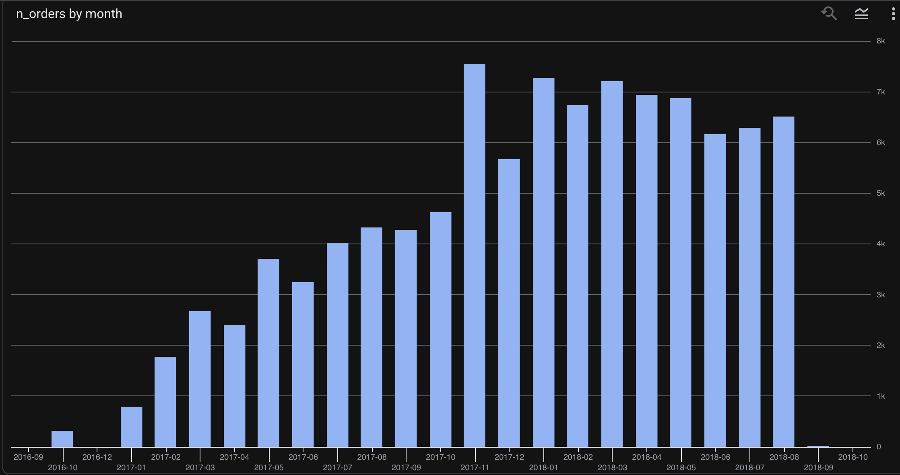

**Month-over-month revenue change**
- The platform's very first comparable month shows a month-over-month growth rate of roughly **65,000%** — not a meaningful trend, just the mathematical effect of comparing against a starting month with only a handful of orders. Any percentage change calculated against a tiny base will produce an extreme, distorted number like this.
- Excluding that startup distortion, the **real peak growth was 108.68% in February 2017** — still strong, but a genuine reflection of early platform momentum rather than a math artifact.
- Since that February 2017 peak, month-over-month growth has been on a **general decline** — consistent with a marketplace maturing out of its early hyper-growth phase into steadier, slower growth.

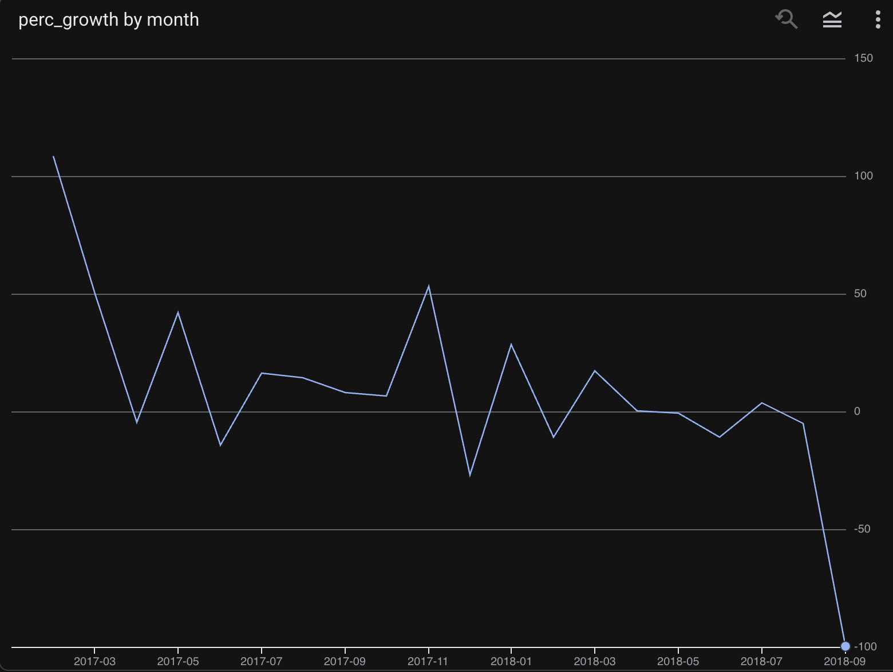

**Total revenue per seller**
- Act 1, Q3 — the top individual seller's revenue.
- The **top 10 sellers account for 12.93%** of total platform revenue. This is actually a **healthier spread than the typical concern threshold** (concentration risk usually gets flagged above ~25–30% for the top 10) — revenue is fairly distributed across Olist's seller base rather than dependent on a handful of accounts.

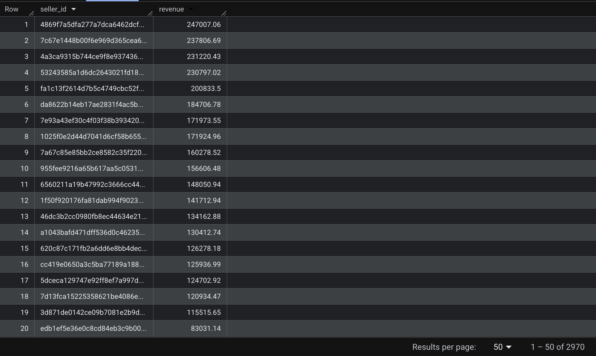

---

## Act 2 — Customer Behaviour

**Repeat purchase rate**
- Only **3.12%** of customers placed more than one order.
- This is **low** for an e-commerce marketplace — typical repeat-purchase benchmarks sit in the 20–30% range. This is one of the most important findings in the whole analysis: Olist is overwhelmingly a **one-time-purchase platform**, which has direct implications for customer acquisition cost and lifetime value.

**Revenue by state**
- Act 2, Q2 — top state's % of revenue, plus the top 3 states combined %.
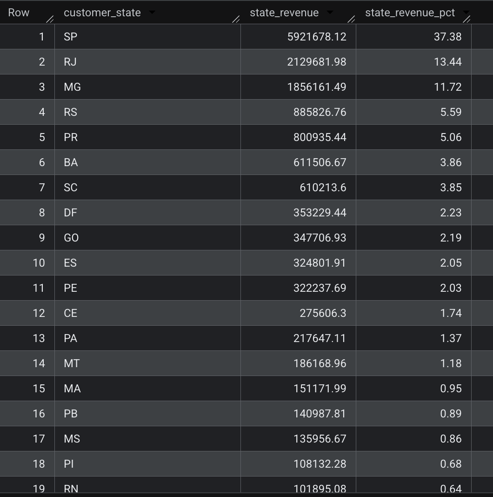

**Installments vs. paid in full**
- Customers who paid in installments had an average order value of **$198.68**.
- Customers who paid in full had an average order value of **$121.04**.
- **Installment customers spend 64% more on average** than full-payment customers. This suggests installments are a meaningful purchasing lever — customers are willing to commit to larger purchases when the payment is spread out, which has direct implications for how Olist or its sellers might price and promote higher-ticket items.

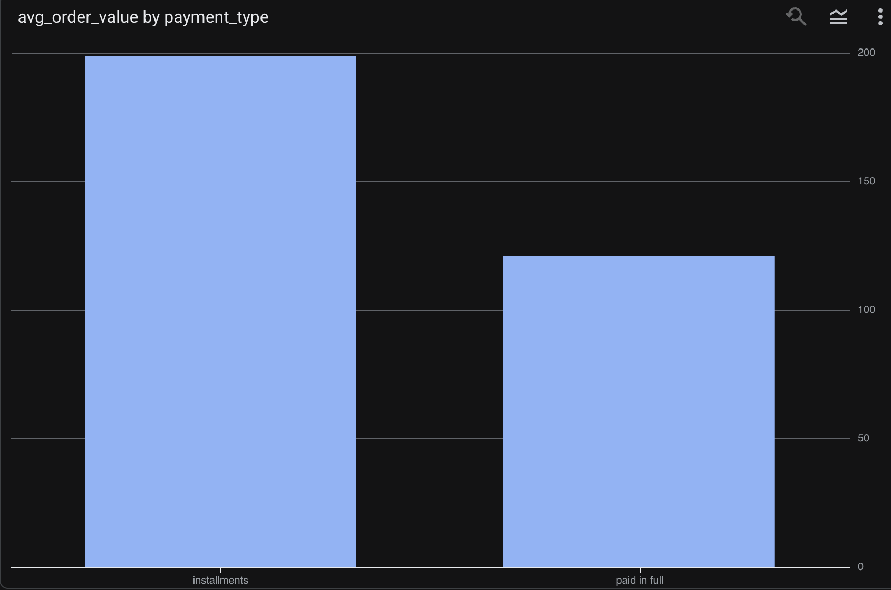

---

## Act 3 — Operations

**On-time delivery rate**
- **91.89%** of orders were delivered on or before the estimated delivery date.
- This is a strong operational baseline — the platform's logistics largely deliver on their promise to customers. It also reframes the rest of this act: the delivery problems explored below (slow states, slow categories, underperforming sellers) are not platform-wide failures, but **localized weak spots within an otherwise well-performing system** — which makes them easier and more targeted to fix.

**Slowest states**
- **Roraima** had the longest average delivery time at **28.98 days**.
- **9 states** have an average delivery time greater than 20 days — meaning a meaningful chunk of Brazil's geography sits well above the platform norm, not just a single outlier state.

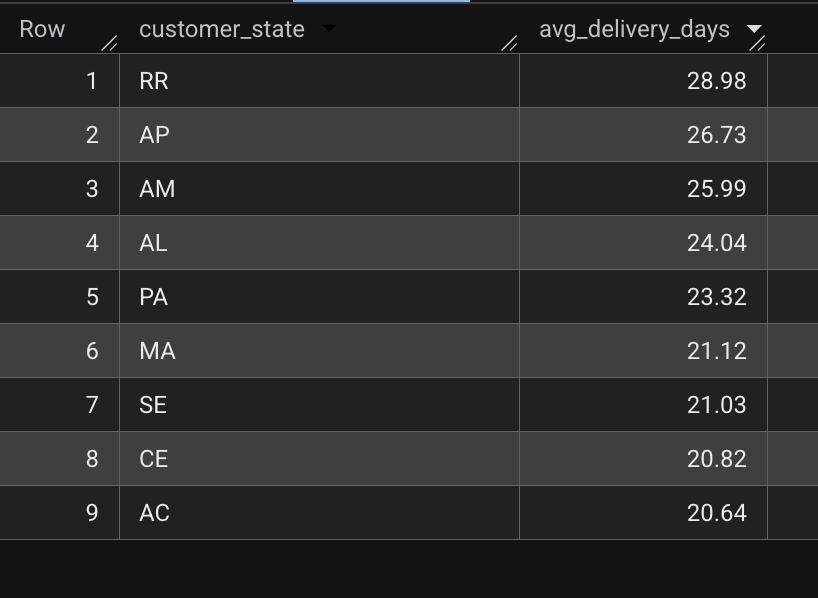

**Slowest product categories**
- Act 3, Q3 — slowest product category and its average delivery time.

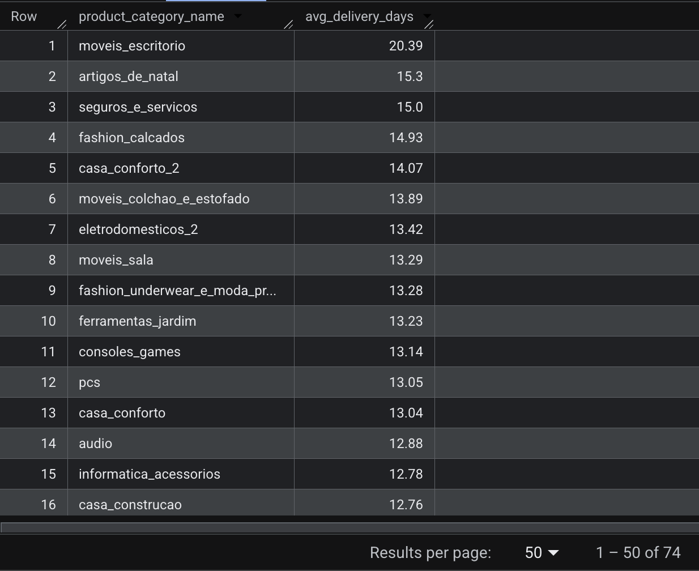

---

## Act 4 — Seller Performance

**High-volume sellers**
- Act 4, Q1 — count of sellers who fulfilled more than 100 orders

**Underperforming sellers**
- **316 sellers** had an on-time delivery rate below 80%.
- Combined, these sellers generated **$677,825.99** in revenue — a financially significant segment. Improving logistics specifically for these 316 sellers would meaningfully move the platform-wide on-time delivery rate without requiring a blanket operational overhaul.

**High-revenue, low-rating sellers (risk segment)**
- **113 sellers** fall into the top revenue quartile while also sitting in the bottom review-score quartile.
- These sellers are generating strong revenue today but are actively accumulating reputational risk — they are the platform's clearest candidates for a seller-performance intervention before satisfaction issues compound into churn.

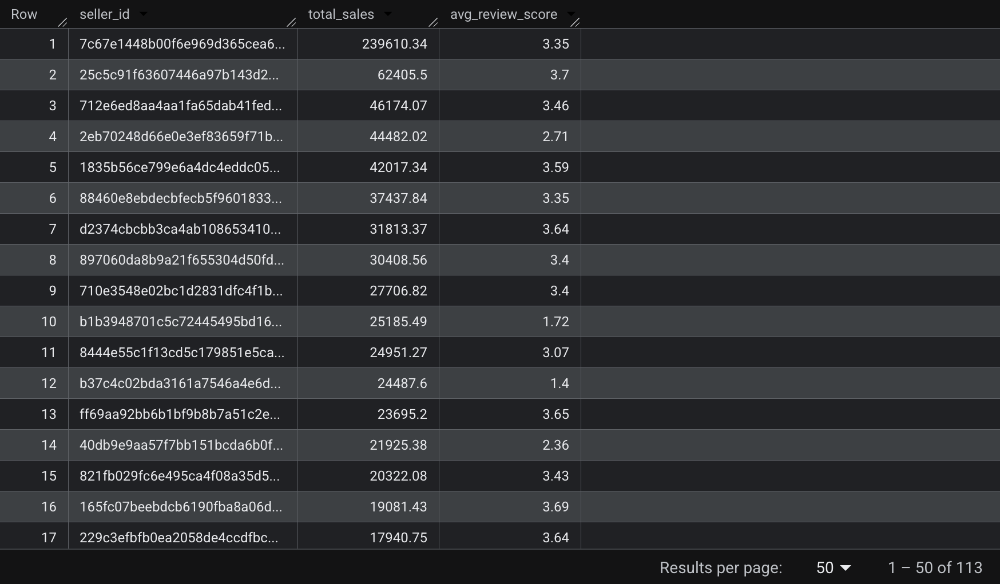

---

## Act 5 — Customer Experience

**Review scores by category**
- Act 5, Q1 — lowest-scoring category + its score, highest-scoring category + its score.

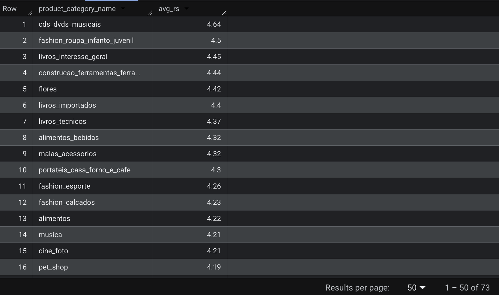

**Late delivery vs. review score**
- Act 5, Q2 — average review score for late orders vs. average review score for on-time orders.

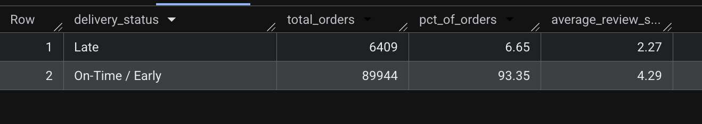

**Delay on 1-star reviews**
- Orders that received a 1-star review were delivered an average of **12.36 days later** than the platform average delivery time.
- This is the clearest single data point in the entire analysis connecting operations to customer sentiment — a 12+ day delay is not a minor inconvenience, it is the kind of gap that turns a customer into a detractor.

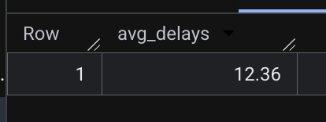

---

## Overall Takeaway

Across the acts completed so far, the data tells a story of a platform with **strong core logistics and healthy seller revenue distribution, but a serious customer retention problem.** Only 3.12% of customers return for a second order — a far bigger concern than delivery performance, which sits at a solid 91.89% on-time rate platform-wide. The delivery issues that do exist are concentrated, not systemic: 9 states average over 20 days, and a specific risk segment of 113 sellers is generating meaningful revenue while under-delivering on customer experience. The 12.36-day average delay on 1-star reviews shows that when delivery does fail, the impact on sentiment is severe — but the bigger strategic question this data raises is why so few customers come back at all, even when their first experience goes well.
